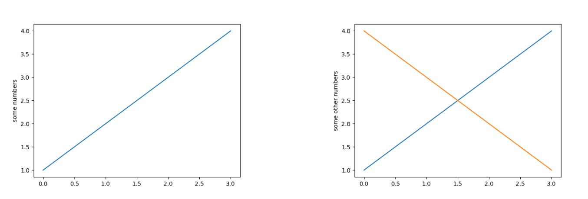
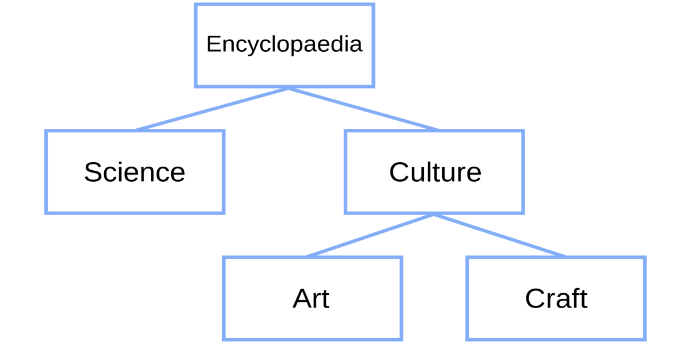

# Programming (Python) <br /> for Data-Science
### Basics:<br /> Advanced  Programming   

<br />
<br />

**Guillaume.Lozenguez**
[@imt-nord-europe.fr](mailto:guillaume.lozenguez@imt-nord-europe.fr)


---
<!-- --------------------------------------------------------------- -->


<br />

- **Modular Programming**
- **Inheritance and Interface**
- **Test-Driven Development**
- **Let's play**

---
<!-- --------------------------------------------------------------- -->

## Modular Programming - Definition

<br />

"_Modular Prog._ is a software design technique that emphasizes separating the functionality of a program into independent, interchangeable modules, such that each contains everything necessary to execute only one aspect of the desired functionality." [Wikipedia Sept. 2023](https://en.wikipedia.org/wiki/Modular_programming)

<br />

### In practice:

- Function _>_ Class _>_ **Module**/**Package**/**Namespace**

---
<!-- --------------------------------------------------------------- -->

## Modular Prog. - One file Package (Python)

<div class="line">
<div class="one2">
One file with definitions, instantiations and instructions.

`myPkg.py`
```python
import some.dependencies

def aFunction() :
    ...

class aClass:

aSpecialInstance= aClass()

...
```

</div>
<div class="one2">

then scripts...

`myscript.py`
```python
import myPkg

myPkg.aFunction()
anInstance= myPkg.aClass()
if( anInstance == myPkg.aSpecialInstance )
    ...

```


or 
```python
from myPkg import aFunction
```


</div>

</div>

---
<!-- --------------------------------------------------------------- -->

## Modular Prog. - Python Package

Python modules are not only libraries (ie. a collection of definitions).

**Example with pyplot:**

```python
import matplotlib.pyplot as plt
                                
plt.plot([1, 2, 3, 4])           # Create a plot on an hidden instance of something
plt.ylabel('some numbers')       # feed the hidden instance
plt.savefig('pyplot1.png')     

plt.plot([4, 3, 2, 1])           # Continue to feed the hidden instance
plt.ylabel('some other numbers')
plt.savefig('pyplot2.png')
```

As a result, the `pyplot2.png` includes the 2 graphics.


---
<!-- --------------------------------------------------------------- -->

## Modular Prog. - Python Package

**Example with pyplot:** 

<div class="line">
<div class="one2">

As a result, the `pyplot2.png`
includes the 2 graphics:
(to avoid that: `plt.clf()`)

</div>
<div class="one2">



</div>
</div>

**On matplotlib (github):**

```python
def savefig(*args, **kwargs) -> None:   
    fig = gcf()                         # get a context, on documentation : 
    res = fig.savefig(*args, **kwargs)  #  | matplotlib.pyplot.gcf()
    fig.canvas.draw_idle()              #  |     Get the current figure.
    return res                          #
```

---
<!-- --------------------------------------------------------------- -->

## Modular Prog. $-$ Complete Packages (Python)

<div class="line">
<div class="one2">

**Tree structure**
of several sub-modules: 

</div>
<div class="one2">



</div>
</div>
<div class="line">
<div class="one2">

A classical tree view:

<br />

[On Wikipedia](https://en.wikipedia.org/wiki/Tree_structure)

</div>
<div class="one2">

encyclopedia
&ensp;&#9504; culture
&ensp;&#9475; &ensp;&#9504; art
&ensp;&#9475; &ensp;&#9494; craft
&ensp;&#9494; science

</div>
</div>

---
<!-- --------------------------------------------------------------- -->

## Modular Prog. $-$ Complete Packages (Python)

**Tree structure** of python package.  A `__init__.py` in each module directory

_encyclopedia_ example:

<div class="line">
<div class="one2">

**encyclopedia**
&ensp;&#9504; `__init__.py`
&ensp;&#9504; **culture**
&ensp;&#9504; &ensp;&#9504; `__init__.py`
&ensp;&#9475; &ensp;&#9504; `art.py`
&ensp;&#9475; &ensp;&#9494; `craft.py`
&ensp;&#9494; `science.py`

</div>
<div class="one2">

Importing the package modules:

```python
import encyclopedia
# -> load encyclopedia/__init__.py

import encyclopedia.culture
# -> load encyclopedia/culture/__init__.py

import encyclopedia.culture.art
# -> load encyclopedia/culture/art.py

etc...
```

</div>
</div>

---
<!-- --------------------------------------------------------------- -->

## Modular Prog. - Accessing Packages


**Import:** the interpreter _need_ the package location.

- **Inside** your Python script:
The _sys.path_ variable lists the location where resources can be imported

```python
import sys
print( sys.path ) # To notice: `sys.path[0]` matches the script location.
``````

- **Outside** the script, in your shell
An environement variable _PYTHON_PATH_ can be set:

```sh
export PYTHON_PATH="/one/path:/an/other/path" $ echo $PYTHON_PATH
python3 myScript
```

---
<!-- --------------------------------------------------------------- -->

## Modular Prog. - Accessing Packages

- **Realtive** in module trees,
sister-modules can be imported relatively.

<div class="line">
<div class="one2">

**encyclopedia**
&ensp;&#9504; `__init__.py`
&ensp;&#9504; **culture**
&ensp;&#9504; &ensp;&#9504; `__init__.py`
&ensp;&#9475; &ensp;&#9504; `art.py`
&ensp;&#9475; &ensp;&#9494; `craft.py`
&ensp;&#9494; `science.py`

</div>
<div class="one2">

For instance, in `craft.py`

```python
import .art
import ..science

...
```

</div>
</div>


---
<!-- --------------------------------------------------------------- -->

## Modular Prog. - Accessing Packages

<br/>
<br/>

- **Dynamic**
The `importlib` module permits more control in the imports.
For instance, manipulate modules to import as variables.
<br/>
- **Virtualize**
Setup a specific environment for the interpreter.
(Python tools: *venv* - virtual environnement) 

<br/>
<br/>

---
<!-- --------------------------------------------------------------- -->


<br />

- Modular Programming
- **Inheritance and Interface**
- Test-Driven Development
- Let's play

---
<!-- --------------------------------------------------------------- -->

## Inheritance - An OOP feature

<div class="line">
<div class="one2">

"In object-oriented programming, inheritance is the mechanism of basing an object or class upon another object or class." [Wikipedia, sept. 2023](https://en.wikipedia.org/wiki/Inheritance_(object-oriented_programming))

</div>
<div class="one2">


</div>
</div>

---
<!-- --------------------------------------------------------------- -->

## Inheritance - In python

<div class="line">
<div class="one2">

Parent class:

```python 
class Animal :
    def __init__(self):
        self._attr1= "xxx"
        self._attr2= "yyy"

    def move(self):
        ...
    
    def eat(self):
        ...
```

</div>
<div class="one2">

Child class:

```python 
class Dog(Animal) :          # Inheritance
    def __init__(self):
        super().__init__()   # Parent’s init.
        self._attr3= "zzz"

    def move(self):          # Override
        ...
    
    def bark(self):
        ...
```

</div>
</div>

---
<!-- --------------------------------------------------------------- -->

## Inheritance - In python

**Specificities in python**

- _Overriding_: **Yes**
```python
medor= Dog()
medor.aMethod() # call for Dog:aMethod if exit and Animal:aMethod otherwise
```
- _Access to parent_'s method: `super()` (inside a method)
- _Multiple inheritance_: **Yes** 
```python
class aClass4(aFather, aMother):
   ...
```
- _Abstract Class_: **Not Realy**  (method with `pass` or `assert("to override")`)
    Python modules exit: *abc* (like for enumerate)

---
<!-- --------------------------------------------------------------- -->

## Interface - Another OOP feature

<br />

"In object-oriented programming, an interface or protocol type is a data type that acts as an abstraction of a class." [Wikipedia, sept. 2023](https://en.wikipedia.org/wiki/Interface_(object-oriented_programming))

<div class="line">
<div class="one2">

**Example:**

```
sort(aCollection)
```

Suppose that: 

- _aCollection_ is iterable into _things_
- _things_ can be compared
- _aCollection_ can be re-ordonned

</div>
<div class="one2">

**Langues:**

- C: **Not simple**
- C++: **Template**
- Java: **Interface** 
- Python: **Nativelly**

</div>
</div>

<br />

---
<!-- --------------------------------------------------------------- -->

## Interface - it is natural in Python

<br/>

In python (_Dynamic-Typing Power_), we do not care about the type.
We only care about existing methods.

<br/>

**For instance** 

```python
def best( aThing, anotherThing )
    if aThing.value() >= anotherThing.value() :
        return aThing
    return anotherThing
```

Suppose that _aThing_ and _anotherThing_ both has a method: _value()_.
(potentially: `type(aThing) != type(anotherThing)`)

---
<!-- --------------------------------------------------------------- -->

## Interface - Python built-in interface

Most of the classical operand can be defined, for instance with _addition_:

```python
class ValuableObj:
    def __init__(self, value):
        self._value= value

    def __str__( self ):
        return f"-{self._value}-"
    
    def __add__( self, another ):
        return ValuableObj( self._value + another._value )
    
t1= ValuableObj( 28 )
t2= ValuableObj( 14 ) 

print( t1 + t2 )
```

---
<!-- --------------------------------------------------------------- -->

## Interface - Python built-in interface

- **Comparison:** ( `anInstance == anotherOne` )
`__lt__()`: lesser than, `__le__()`: lesser or equal,
`__gt__()`: greater than, `__ge__()` greater or equal,
`__eq__()`: equal and `__ne__()` not equal
- **Iterable:** ( `for elt in aCollection :` )
`__iter__()`: initialize an iterator. 
and `__next__()`: return the next element of the iteration
(or `raise StopIteration`) 
- **Operation:** $\quad$ `__add__()`, `__sub__()`, `__mul__()`, ...
- **Array:** (`aCollection[i]`) $\quad$ `__getitem__()`

---
<!-- --------------------------------------------------------------- -->


<br />

- Modular Programming
- Inheritance and Interface
- **Test-Driven Development**
- Let's play

---
<!-- --------------------------------------------------------------- -->

## Test-Driven Development - Test Comme First

<br />
<br />

"Test-Driven Development (TDD) is a software development process relying on software requirements being converted to __test cases before__ software is fully developed, and tracking all software development by repeatedly testing the software against all test cases. This is as opposed to software being developed first and test cases created later." [Wikipedia sept. 2023](https://en.wikipedia.org/wiki/Test-driven_development)

<br />

_Why?_ - To **test** but also to **well define** the functionality to develop.

<br />

---
<!-- --------------------------------------------------------------- -->

## Test-Driven Development - Test Comme First

#### You wan to develop a functionality<br />Develop the tests of the functionality first.

<div class="line">
<div class="one2">

**1. Specification:**

- need to manipulate points
- compute distance
- set a color
- generate graphics
- ...

**3. Development:**

We know where we go...

</div>
<div class="one2">

**2. Test:**

```python
point1= Point(10.0, 34.5)
point2= Point(12.0, 34.5)

assert(
    round( point1.distance( point2 ), 8 )
    == 2.0
)

point1.setColor( BLUE )

assert( point1.color() == BLUE )

...

```

</div>
</div>

---
<!-- --------------------------------------------------------------- -->

## Test-Driven Development - A Simple Tool: _pytest_

1. **define test cases** in test scripts (all starting by `test_`). 
```python
# test_myFunctionality.py
def test_aFirstTestCase:
    ...
    assert( instruction expected to be True )
    ...

def test_aSecondTestCase:
    ...
```

2. test all your test_case in all your test script (all starting by `test_`).

```sh
# In your favorite shell:
> pip3 install pytest
> python3 -m pytest # or pytest directly
```

---
<!-- --------------------------------------------------------------- -->


<br />

- Modular Programming
- Inheritance and Interface
- Test-Driven Development
- **Let's play**

---
<!-- --------------------------------------------------------------- -->

## Let's play - Again Regressor exercise

<br />
<br />

- Get a correction including _Cloud_, _Model_ and _ModelLinear_
- Understand the _tree-structure_ of Modules and Classes
- Increment with a new _Model_.
- Modify the solution.

<br />
<br />
<br />

---
<!-- --------------------------------------------------------------- -->

## Let's play - Understand Other Developer

<br />
<br />

- Get the correction from :
https://bitbucket.org/imt-mobisyst/lecture-data-science/raw/master/corrections/regressor.zip
- Unzip and run example script.
- Try to understand the code
- Run the tests

<br />
<br />

---
<!-- --------------------------------------------------------------- -->

## Let's play - Understand Other Developer

Todo: UML

---
<!-- --------------------------------------------------------------- -->

## Let's play - Create a new Model

### Model Plates3:

$$ y= py\left( \mathit{plate}(x) \right) + \mathit{error}$$

* $py(p)$ the `y` coordinate of a plate `p`.
* $\mathit{plate}(x)$ the plate at the coordinate `x`.


<div class="line">
<div class="one2">

In other terms, all `x` of a given plate
share the same `y`. - **Example:**

</div>
<div class="one2">


</div>
</div>

- As a first use case we consider always 3 plates.

---
<!-- --------------------------------------------------------------- -->

## Let's play - Create a new Model

### Model Plates:

- _ModelPlates3_ should inherit from _Model_.

_Model_ class provide methods for cloud generation.
It only requires a method returning an _y_ from a given _x_, the method _estimate_.
This method is 

- Create a class _ModelPlates3_
- Develop the required method (_estimate_)

- You should be capable of generating Clouds...

---
<!-- --------------------------------------------------------------- -->

## Let's play - Generic Parameters Estimation

<br />

- Actually _ParametersEstimation_ is only computed by _ModelLinear_. 
It is composed of tree steps:
    - Initialize a first parameter tuple.
    - Optimize a given parameter (a or a) considering a given precision
    - Loop, by decrising the precision
- However all Model Parameters' estimation can follow the same process.
That for, this process can be defined at the root _Model_ class.

<br />
<br />

---
<!-- --------------------------------------------------------------- -->

## Let's play - Generic Parameters Estimation

- Define for each inherited class the methods: 
    - `paramaterSize()`: returning the number of parameters
    - `paramater(i)`: returning the value of the $i$th parameter
    - `setParamater(i, aValue)`: to force the $i$th parameter
    on a given value `aValue`.
- Add test on `test_` scripts.
- Move parameters estimation method from _ModelLinear_ to _Model_ class
- Adapte those methods to be generic (on `parameter` methods rather than specific `a` and `b` parameters)

---
<!-- --------------------------------------------------------------- -->

## Let's play - Modify the solution

<br />

### Square Error

<br />

The optimization method based on the average error is not efficient.
Resulting estimation does not care about huge error when most of the point fit the model. 


<br />
<br />

---
<!-- --------------------------------------------------------------- -->

## Let's play - Create a new Model

<br />
<br />

### Model: MultiPoints 

Compared to _ModelPlate_, the `y` coordinate is computed in a smooth way between the 2 closest plate centers for a `x` coordinate. 

<br />
<br />
<br />
<br />

