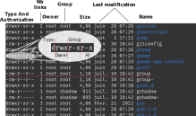

# Programming (Python) <br /> for Data-Science
### The basics: The conputer <br /> and the program   

<br />
<br />
<br />

**Guillaume.Lozenguez**
[@imt-nord-europe.fr](mailto:guillaume.lozenguez@imt-nord-europe.fr)


---
<!-- --------------------------------------------------------------- -->


<br />

- **The Shell (or terminal)**
- **Codes, Programs and Scripts**
- **Let's play**

---
<!-- --------------------------------------------------------------- -->

## The Revolution of Modern Computing

<div class="line">
<div class="one2">

### At the begining was the Shell :

**A computer program that exposes an operating system's services to a human user or other programs.** ([Wikipedia - Sep. 2023](https://en.wikipedia.org/wiki/Shell_(computing)))

(can also be named _a terminal_)

Vocabulary: Prompt, Command

</div>
<div class="one2">


</div>
</div>

---
<!-- --------------------------------------------------------------- -- >

## History of The Shell


---
<!-- --------------------------------------------------------------- -->

## Basics: The File System

### Some Commands:

<div class="line">
<div class="one2">

- _ls_: list directory elements
- _cd_: change directory
- _cat_: read all a text file
- _more_: read a text file step by step
- _touch_: touch a resource (create it)
- _nano_: edit a text file
- _rm_: remove a file (permanently)

</div>
<div class="one2">

- _mkdir_: create (make) a directory
- _rmdir_: remove a directory
- _mv_: move a resource
- _cp_: copy-paste a file
- _clear_: clear your promt

</div>
</div>

---
<!-- --------------------------------------------------------------- -->

## Basics: The File System

### Resource Path:

- _/_: the root directory in Linux system <br /> example: `du /bin/bash` (du - estimate file space usage)
- _._: the current directory - example: `mkdir ./workspace`
- _.._: the parent directory - example: `cd ../../media`
- _~_: the user directory - example: `cd ~/Documents`
- **CApitAl Letters maTer** - example: `cd ~/Documents` $\neq$ `cd ~/documents`


---
<!-- --------------------------------------------------------------- -->

## Basics: Commands

Classical syntaxe: `command --option -o argument1`

Example: `ls -a ~`

### Commands for Mastering Commands:

- _man_: command and library manuel - example: `man cp`
- _apropos_: command manuel - example: `apropos copy`
- _whereis_: find the location of a resource - example: `whereis python3`
- _alias_: create our own command - example: `alias listall="ls -a"`

---
<!-- --------------------------------------------------------------- -->

## Basics: a Session

**An active connection to a system or program.**

- _who_: List the open session in a computer
- _ssh_: Open a session in a distant computer following the ssh protocol

### Environement

**computer system or set of systems in which a computer program or software component is deployed and executed.**([Wikipedia Sept. 2023](https://en.wikipedia.org/wiki/Deployment_environment))

- _env_: list the environement variable.
- _$_: access a variable - example: `echo $PATH`
- _export_: create a new variable - example: `export PATH=$PATH:~/bin`
- _~/.bashrc_ (file): user configuration commands.

---
<!-- --------------------------------------------------------------- -->

## Basics: User, Group and Rules

- User are identified and attached to groups
- User and group have a name and a number
- Resources are owned by a user and a group
- Specific access can be tuned for each resource 
    -  _r_: read $\quad$ _w_: write $\quad$ _x_: executed/open
    -  For the _user_, the _group_ members and _all_ the others

Example with `cat /etc/passwd` (list of users) <br /> and `cat /etc/group` (list of groups)

---
<!-- --------------------------------------------------------------- -->

## Basics: User, Group and Rules

Example with `ls -l /etc`



---
<!-- --------------------------------------------------------------- -->

## Basics: User, Group and Rules

### Again Some Commands...

- _chmod_: change authorizations - Examples:
`chmod +x aFile` - add _x_ authorization on _aFile_
`chmod 752 aFile` - set authorisation on _aFile_ on a binary style
- _chown_: change the owner 

---
<!-- --------------------------------------------------------------- -->

## Basics: The Processes

### The Operating System (OS) is mainlly a process manager...

- _ps_: similar to ls but for processes. 
`gedit &` - _&_ permits to get back the prompt
`ps` - List the local processes (ie. children of the bash shell)
`ps -e` - list all processes
- _top_: interactive Porcess monitoring ( _Q_ to quit )
- _kill_: sent a signal to a process 
`kill 19482` - send TERM signal to process _19482_
`kill -s KILL 19482` - send KILL signal to process _19482_

For managing processes, OS attaches some elements to each one:<br />the _PID_ (Process IDentifier), a parents, ...


---
<!-- --------------------------------------------------------------- -->

## Basics: Bash tools

**bash** is one of the shell solution on Unix systems.

- _tabulation_: auto-complete the command line or list the possibilities
- _!xx_: run again the last command starting with `xx`
- _ctrl-r_: search for a command in command history
- _Q_: quit a runnig program
- _ctr-c_: terminate a running program
- _~/.bashrc_: file: user configuration routine

---
<!-- --------------------------------------------------------------- -->


<br />

- The Shell (or terminal)
- **Codes, Programs and Scripts**
- Let's play

---
<!-- --------------------------------------------------------------- -->

## Codes, Programs and Scripts

- **Codes**: Sequence of written instruction in a given programming langague
- **Programs**: Executable binary on a OS
    - Specific to the OS (and potentially to the hardware)
    - Génarly compiled codes (example with _C_ and _gcc_)
- **Scripts**: Interpretable piece of codes by a program - example:
    - _python3_ is a programming langague
    - _python3_ is also a interpreter ([cpython](https://fr.wikipedia.org/wiki/CPython))

file: hello.py

```python
print('hello world')
```

shell: `python3 hello.py`

---
<!-- --------------------------------------------------------------- -->

## Python Programming Langauges

### Sequential Instructions

```python

# some Comments...

a= 1              # - Asignment of a new integer variable
b= a + 48.4       # - Asignment of a new floating point variable
                  #   as the result of the instruction: a + 48.4
aString= "Hello"  # - Asignment of a new string variable (list of characters)

print( aString )  # - Call to the function print with aString as parameter

result= aString.search('e') # - Call to the method search on the aString instance 
                            #   with a parameter 'e'

```

---
<!-- --------------------------------------------------------------- -->

## Python Programming Langauges

### With function definition

```python
def myWonderfullFunction( aFirstIntergerPaprameter, aSecondIntergerParameters )
    intergerSum= aFirstIntergerPaprameter + aSecondIntergerParameters
    return intergerSum

a= 2
b= myWonderfullFunction( a, 40 )

print( "Result: " + str(b) )
```

_To notice:_ block separtion is delimited with space or tabulation indentation.

---
<!-- --------------------------------------------------------------- -->

## Python Programming Langauges

### And loop control

```python
aList= [2, 40]
b= 0
for value in aList :
    b+= value

print( "Result: " + str(b) )
```

```python
b= 0
while b < 42 :
    b+= 2

print( "Result: " + str(b) )
```

---
<!-- --------------------------------------------------------------- -->

## Python, a Modular tool

**resources:** `myOwnPkg.py`

```python
def myWonderfullFunction( aFirstIntergerPaprameter, aSecondIntergerParameters )
    intergerSum= aFirstIntergerPaprameter + aSecondIntergerParameters
    return intergerSum

```

**script:** `myOwnCommand.py`

```python
import myOwnPkg

...

b= myOwnPkg.myWonderfullFunction( a, 40 )
...

```

---
<!-- --------------------------------------------------------------- -->

## Python, a Modular tool

- Python packages are easy to install with `pip` tool.

```sh
pip install tqdm pytest
```

- python _import_ relies on environement path variable:

```python
import sys
print( sys.path )
```
- _Question ?_ $\quad$ Where is `tqdm` ?

---
<!-- --------------------------------------------------------------- -->

## Python Interpreter (cpython)

<br />
<br />

- Code source: [github.com](https://github.com/python/cpython) - 63.5% Python / 34.6% C 
- _Compile_ them _Interpret_ the program 
- Memory Managment: _Dynamic Type_, _Garbage Collector_
- Object-Oriented Programming (OOP)

<br />
<br />
<br />
<br />


---
<!-- --------------------------------------------------------------- -->

## Python Specifity

<br />

- **Rich language capabilities** (it is possible to do complexe things)
- **Concise language** (complexe things requires few codes)
- **Very rich community librairies** 
(Most of the complexe things are already implemented)
- **Interpretable** (the code is mostly OS independant)
- **Use a virtual machine** (including Garbage Collector)
- **Not efficient** (but easy interface to C and C++)

<br />

As a results: a diversified use: _system administration_, _web_, _data science_, ect.


---
<!-- --------------------------------------------------------------- -->


<br />

- The Shell (or terminal)
- Codes, Programs and Scripts
- **Let's play**


---
<!-- --------------------------------------------------------------- -->

## Exercice: Search for a User's Groups

#### Create a command that take a user name in parameter <br /> and return (print) all its groups.

<br />

Process in a incremental way:

- Decompose the module to develop
- Implement it step by step
- Test the solution at each step


<br />
<br />

---
<!-- --------------------------------------------------------------- -->

## Exercice: Search for a User's Groups

<br />
<br />

#### Open a file and read-it line by line <br /> (`/etc/passwd` and `/etc/group`)


<br />
<br />
<br />

Search on : `python open` $\rightarrow$ [W3School](https://www.w3schools.com/python/ref_func_open.asp)

<br />
<br />

---
<!-- --------------------------------------------------------------- -->

## Exercice: Search for a User's Groups

<br />
<br />
<br />
<br />

#### Search for a specific word in a line


<br />
<br />
<br />
<br />
<br />


---
<!-- --------------------------------------------------------------- -->

## Exercice: Search for a User's Groups

<br />
<br />
<br />
<br />

#### Increment a list (the group names, starting by its main group name)

<br />
<br />
<br />
<br />
<br />


---
<!-- --------------------------------------------------------------- -->

## Exercice: Search for a User's Groups

<br />
<br />
<br />
<br />

#### Make-it as a beautifull shell command <br />(executable, user name as a parameter, easy to find)


<br />
<br />
<br />
<br />

---
<!-- --------------------------------------------------------------- -->

## Exercice: Search for a User's Groups

<br />
<br />
<br />
<br />

#### Handle bugs (not a user name, no groups, no system file, -h option, etc..)

<br />
<br />
<br />
<br />
<br />