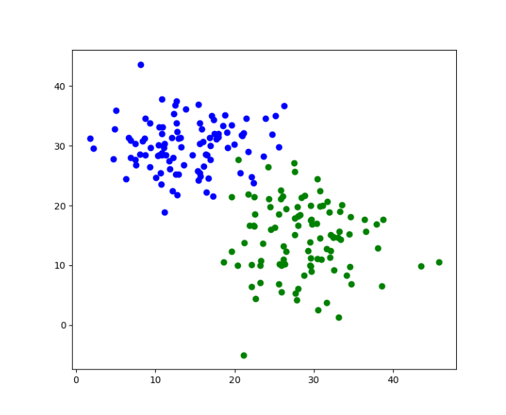
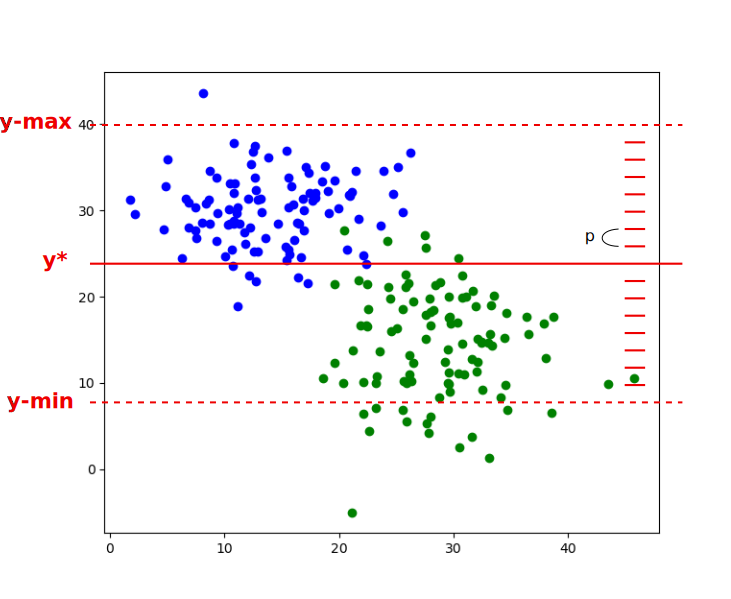

# Programming (Python)   for Data-Science
### First Manipulations

 
 
 

**Guillaume.Lozenguez**
[@imt-nord-europe.fr](mailto:guillaume.lozenguez@imt-nord-europe.fr)

---

#### La vie est un éternel recommencement…

#### **The life is an eternal restarting…**

---
<!-- --------------------------------------------------------------- -->

 

- **Classification**
- **Let's play**

---
<!-- --------------------------------------------------------------- -->

## Classification

The capacity to tag an observation with it appropriate descriptors.
For instance, a _country_ given hearth coordinates.

Latitude | Longitude | Elevation | country
---------|-----------|-----------|-----------
49.70    | 4.92      | 200       | France
49.81    | 5.06      | 230       | Belgique
45.78    | 3.09      | 450       | France
42.70    | 0.79      | 980       | Espagne
...      |           |           |   

What about (_43.40_, _3.66_, _176_) ????

---
<!-- --------------------------------------------------------------- -->

## Classification

 
 

**More formally:**

$$ \text{predict } Y_i \text{ from } X_i \quad or: \quad  Y_i = \mathit{classifier}( X_i ) $$

 

*With:* $Y_i$ defined in a **Finit Countable Set** 

$$Y_i \in [Value_1, Value_2, \ldots, Value_N]$$

 
 

---

## Classification

**In other terms:**
Space Partitioning or Clustering

 
 

Example of 2D variables into 17 classes: 

---
<!-- --------------------------------------------------------------- -->

## Classification

 

**Linear classifier**

Is the data on the *left* or *right* 
from a given vector separation ?

> Support Vector Machines

---
<!-- --------------------------------------------------------------- -->

 

- Classification
- **Let's play**

---
<!-- --------------------------------------------------------------- -->

## Classifier - Generate data

#### Beautiful Cloud - a 2-Dimension data Structure

We wan to generate Clouds
around a given position.

_But_ the closest to the center
the more probable. 

Typically it is possible by using **Gaussian** approach:
With [numpy](https://numpy.org/doc/stable/reference/random/generated/numpy.random.normal.html), for instance.

([Normal Distribution on Wikipedia](https://en.wikipedia.org/wiki/Normal_distribution))

---
<!-- --------------------------------------------------------------- -->

## Classifier - Generate data

#### Classifier: A object based on $2$ Clouds.

We wan to generate 2 Clouds
around a given position.

- Generate a 2-clouds data set  and plot them in 2 colors

**The second cloud is always the cloud with a greater average $y$ coordinate.**

---
<!-- --------------------------------------------------------------- -->

## Classifier - Simple-Y

- Simple _$y$_ Classifier is composed by $1$ attribute.
    - The _$y$_ coordinate, modeling a horizontal separation.
    - class-1 is considered smaller than _$y$_ and class-2 greater.
- Classifier efficiency relies directly on the number of misclassification.
Evaluation of a Classifier requires to confront the data set to their predicted class by the model (1 or 2).
 
- To-Do:
  - Initialize a _$y$_ value as you want.
  - Plot the horizontal separation.
  - Count the errors based on a `predictClass(x, y)` method.

 

---
<!-- --------------------------------------------------------------- -->

## Classifier - Simple-Y : Parameter Optimization

- **Optimize $y$** considering 2 Clouds:
  - Initialize with an heuristic _$y=y^0$_
  - Search the optimal _$y^*$_   considering a delta _$d$_  by moving _y_ with _$\pm d$_

 

---
<!-- --------------------------------------------------------------- -->

## Classifier - Circle : 

### A Circle tries to cash the Class-1 data

  - Attibutes (3):
  Circle center coordinates + radius.
  - Class-2 data are data
   outside the circle.

---
<!-- --------------------------------------------------------------- -->

## Classifier - Circle : 

### `ClassifierCircle` should implement  the same methods as `ClassifierSimpleY`

  - initializeParameters()
  - predictClass(x, y)
  - countError()
  - plot()
  - optimizeParameters( precision )
  - ...

---
<!-- --------------------------------------------------------------- -->

## Classification - ClassifierLinear

#### Compute a Linear Classifier

- **Search for the best separation:**

But maybe it is time to use inheritance   to factorize parameter optimization algorithm into a root class

 

 

 

Inheritance: on [Wikipedia](https://en.wikipedia.org/wiki/Inheritance_(object-oriented_programming)) and [in python](https://www.w3schools.com/python/python_inheritance.asp)

---
<!-- --------------------------------------------------------------- -->

## Classification - Make Optimization Generic

#### Transform the optimizer developed for Classifier in a more generic version. 

- Manipulate a list of parameters with methods like _getParameters_, _setParameters_, ...  rather than directly the parameter name (_y_ in `ClassifierSimpleY`) for the optimization.
- Loop on all parameters in case of Classifier with several parameters.
- Implement the parameter methods for `ClassifierSimpleY` and `ClassifierCircle`.
- Develope a new child: `ClassifierLinear`.
- **Apply a dichotomy-search style:**
  Repeat the optimization process by dividing the delta $d$ by $2$   until a parameter _$\epsilon$_ value is reached.

 
 
