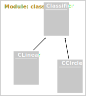

# Programming (Python)   for Data-Science
### First Manipulations

 
 
 

**Guillaume.Lozenguez**
[@imt-nord-europe.fr](mailto:guillaume.lozenguez@imt-nord-europe.fr)

---
<!-- --------------------------------------------------------------- -->

 

- **Classification**
- **Let's play**

---
<!-- --------------------------------------------------------------- -->

## Classification

The capacity to tag an observation with it appropriate descriptors.
For instance, a _country_ given hearth coordinates.

Latitude | Longitude | Elevation | country
---------|-----------|-----------|-----------
49.70    | 4.92      | 200       | France
49.81    | 5.06      | 230       | Belgique
45.78    | 3.09      | 450       | France
42.70    | 0.79      | 980       | Espagne
...      |           |           |   

What about (_43.40_, _3.66_, _176_) ????

---
<!-- --------------------------------------------------------------- -->

## Classification

 
 

**More formally:**

$$ \text{predict } Y_i \text{ from } X_i \quad or: \quad  Y_i = \mathit{classifier}( X_i ) $$

 

*With:* $Y_i$ defined in a **Finit Countable Set** 

$$Y_i \in [Value_1, Value_2, \ldots, Value_N]$$

 
 

---

## Classification

**In other terms:**
Space Partitioning or Clustering

 
 

Example of 2D variables into 17 classes: 

---
<!-- --------------------------------------------------------------- -->

## Classification

 

**Linear classifier**

Is the data on the *left* or *right* 
from a given vector separation ?

> Support Vector Machines

---
<!-- --------------------------------------------------------------- -->

 

- Classification
- **Let's play**

---
<!-- --------------------------------------------------------------- -->

## Classification - Overall Structure

At the end, 
we expect a module like this:

Only binary classification is considered in this exercise (2 classes)

---
<!-- --------------------------------------------------------------- -->

## Classification - Generate data

#### generator: A module function returning a $2\times N$ numpy.array

We wan to generate a 2-dimension
data-set around a given position.

_But_ the closest to the center
the more probable. 

Typically it is possible by using **Gaussian** approach:
With [numpy](https://numpy.org/doc/stable/reference/random/generated/numpy.random.normal.html), for instance.

([Normal Distribution on Wikipedia](https://en.wikipedia.org/wiki/Normal_distribution))

- Generate 2 data-set and plot them in 2 colors

---
<!-- --------------------------------------------------------------- -->

## Classification - Root Classifier Class

 

- The root Classifier. 

The root _Classifier_ class of the Classifier inheritance tree is expected to regroup all the useful methods common to all classifier.

- A very simple classifier. 

The class 1 and 2 are separated considering an _y_ value.

- Create this Classifier with the main method:
    - `aClassifier.estimate( anObservation )`
    returning the class of a given 2D-observation.

 

---
<!-- --------------------------------------------------------------- -->

## Classification - Classification error: 

 

- Simple _y_ Classifier is composed by 2 attributes.
    - The _y_ coordinate
    - A boolean to desambuguise which of the class (1 or 2)
    are in which side of the _y_ frontiers (greater or lesser).
 
- Classifier efficiency relies directly on the number of misclassification.
Evaluation of a Classifier requires confront data-sets:
    - `aClassifier.countErrors( aClass1DataSet, aClass2DataSet )`

 

---
<!-- --------------------------------------------------------------- -->

## Classification - Parameter Optimization

- **Optimize $y$ from
a given 2 classes data-set**
  - Initialize bounds (_y-min_, _y-max_)
  - Set up an expected precision _$p$_
  - Search the optimal _y*_
  in the range(_y-min_, _y-max_, _p_)

 

---
<!-- --------------------------------------------------------------- -->

## Classification - ClassifierCircle

### The Circle classifier try to cash the Class-1 data in a circle

  - Attibutes:
  Circle center + radius.
  - Class-2 data are data
   outside the circle.

Built core methods: **initialize** and **estimate**

---
<!-- --------------------------------------------------------------- -->

## Classification - Make Optimization Generic

 

#### Transform the optimizer developed for Classifier in a more generic version. 

 

- Use methods (_initParameters_, _getParameter_, _setParameter_, ...) rather than directly _y_, in the first version of parameter optimization.
- Loop on all parameters in case of Classifier with several parameters.
- Implement the parameter methods for Classifier and ClassifierCircle.

 
 

---
<!-- --------------------------------------------------------------- -->

## Classification - ClassifierLinear

#### Compute a Linear Classifier

- **Search for the best separation:**

Perpendicular to the linear regression 
build over the 2 data-sets

 

 

 
